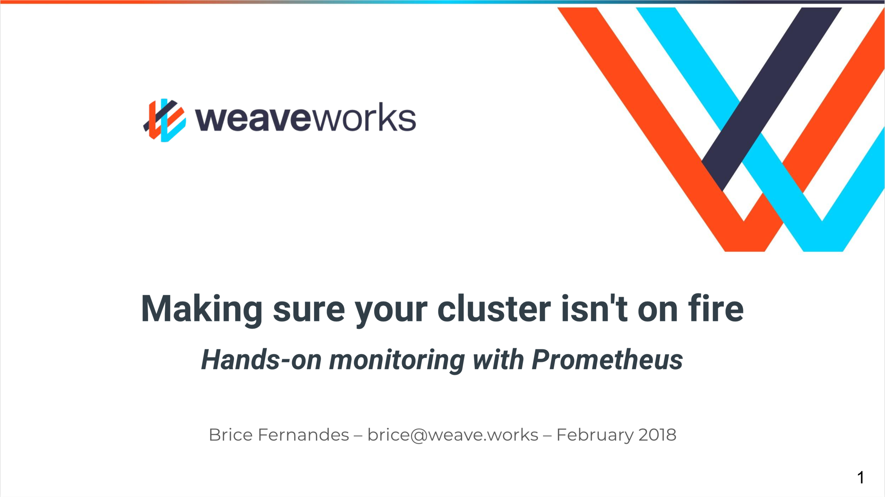

# Making sure your containers aren't on Fire: Monitoring microservices with Prometheus

[](https://quay.io/repository/brice/metrics-demo)

This small demo app was used for
- My [CloudNative London talk 2017-09-27](https://skillsmatter.com/skillscasts/10507-making-sure-your-containers-aren-t-on-fire-monitoring-microservices-with-prometheus)
- My [Software Circus Amsterdam worskhop – 2018-02-28](https://www.meetup.com/Software-Circus/events/247767146/)
- My [QCon Workshop – 2018-03-08](https://qconlondon.com/london2018/workshop/mastering-microservices-monitoring-prometheus)

## Abstract

Monitoring containerised apps creates a whole new set of challenges that traditional monitoring systems struggle with. In this talk, Brice Fernandes from Weaveworks will introduce and demo the open source Prometheus monitoring toolkit and its integration with Kubernetes. After this talk, you'll be able to use Prometheus to monitor your microservices on a Kubernetes cluster. We'll cover: 
- An introduction to Kubernetes to manage containers
- The monitoring maturity model
- An overview of whitebox and blackbox monitoring
- Monitoring with Prometheus
- Using PromQL (the Prometheus Query Language) to monitor your app in a dynamic system

## Software Circus February 2018 Slides

[](https://www.slideshare.net/fractallambda/handson-monitoring-with-prometheus)

## CloudNative 2017 Slides

[](https://www.slideshare.net/fractallambda/monitoring-kubernetes-with-prometheus-80179046)

## Running this demo
Take a look at the manifests directory if you want to run this demo yourself. There is also a [separate repository](https://github.com/bricef/metrics-demo-infra) used for infrastructure operations and automation which will have the latest version of this manifest.

## Credits
- Grafana dashboard used in this talk taken from https://github.com/vegasbrianc/grafana_dashboard
- Joel York's SaaS metrics from http://chaotic-flow.com/media/saas-metrics-guide-to-saas-financial-performance.pdf

## Interesting metrics
Try the following while using the tools scripts to generate subscriptions and unsubscriptions.

```
# How fast are we gaining customers
rate(subscribe_count[1m])

# How fast are we losing customers.
rate(unsubscribe_count[1m])

# How many customer we have in total
subscribe_count-unsubscribe_count

# Our growth rate (instantaneous)
irate(subscribe_count[1m])-irate(unsubscribe_count[1m])

# Our growth rate (using deriv function)
deriv(subscribe_count[1m])-deriv(unsubscribe_count[1m])

# Our Churn (proportion of customers lost per unit time)
rate(unsubscribe_count[1m]) / ((subscribe_count offset 1m) - (unsubscribe_count offset 1m))
```

